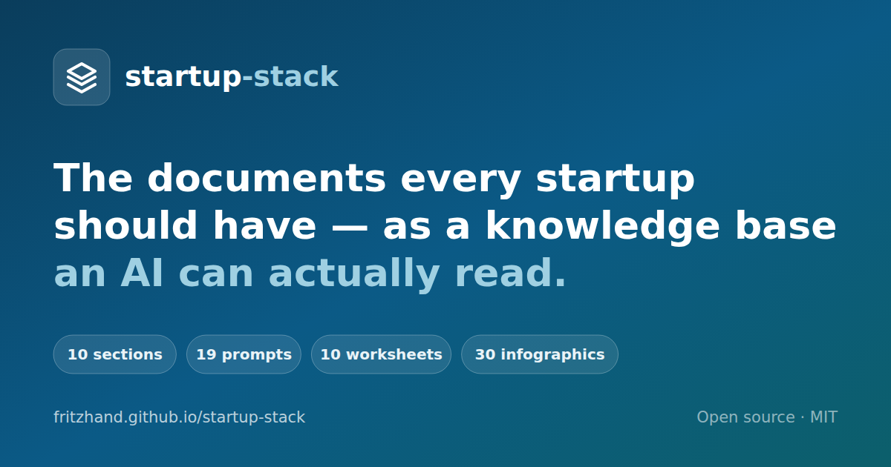

<div align="center">

<a href="https://fritzhand.github.io/startup-stack/"></a>

# startup-stack

**The documents every startup should have — compiled into a knowledge base an AI can actually read.**

Drop your pitch deck, market research, business plan, competitor notes and call transcripts into one folder → an AI turns them into a structured, front-mattered knowledge base → then a library of prompts runs on top of it to produce the work: the deck, the list of 100, the unit economics, the weekly recap.

> Every company, customer, metric and transcript used as an example in this repo is invented. Nothing here is drawn from any real client engagement.

[**New to working with AI**](docs/ai-basics.md) · [**What the words mean**](docs/what-things-are.md) · [**The infographics**](docs/infographics.md) · [**Startup resources**](docs/resources.md) · [**The method**](docs/method.md) · [**Build the knowledge base**](docs/knowledge-base.md) · [**Prompt library**](prompts/INDEX.md) · [**For coaches**](docs/for-coaches.md) · [**For programmes**](docs/for-portfolios.md) · [**Quickstart**](QUICKSTART.md)

[](https://fritzhand.github.io/startup-stack/)


<br>

**10** knowledge-base sections · **19** prompts · **10** worksheets · **30** infographics · **653** indexed external resources · **28** pages of method · a portfolio layer for programmes · a published site, generated from these files

</div>

---

## The problem this solves

Most early founders are carrying their company in their head and in twelve unrelated files. The pitch deck says one number, the projections say another, the market research lives in a PDF nobody has opened since March, and every AI conversation starts from zero — so every answer is generic, and the founder pays for the model to re-read everything, every time.

Meanwhile the advice they need is not exotic. It is the same twenty things, asked in the same order, by every coach who has ever sat across from an early-stage founder: *Who exactly is the customer? What does a unit cost you? Who else is doing this? How many prospects are on your list — five, or a hundred? What happens when the money runs out?*

`startup-stack` makes those questions answerable from one place.

There is a second reader, and the repo now serves them too: the **programme** running a portfolio of these companies — an incubator, accelerator, studio or university venture programme, whose coaching team meets the same founders in recurring sessions and whose institutional memory currently lives in scattered notes. [The page written for them](docs/for-portfolios.md) is the deeper end of the same method. A founder can ignore it entirely.

## The three loops

```
                    ┌──────────────────────────────────────────┐
                    │                                          │
   _inbox/          │            stack/                        │        work
   ───────          │            ──────                        │        ────
   pitch deck       │   INDEX.md  ← the router                 │   pitch deck v2
   business plan  ──┼─▶ CONTEXT.md ← the one-pager             ├─▶ list of 100
   market research  │   01-company … 10-pulse                  │   unit economics
   competitor notes │   ↑ one .md per section, front-mattered  │   investor one-pager
   call transcripts │   ↑ confirmed / unverified / TBD / clash │   weekly recap
   spreadsheets     │                                          │
   design refs      │                                          │
                    └──────────────────────────────────────────┘
        LOOP 1 · BUILD          LOOP 2 · ENRICH          LOOP 3 · PULSE
        (one afternoon)         (every time something     (30 minutes,
                                 real happens)             every week)
```

**Loop 1 — Build.** You put raw material in `_inbox/`. One prompt reads it and writes the stack: ten numbered sections, one markdown file each, every fact tagged confirmed, unverified, missing, or in conflict where two of your own documents disagree. Takes an afternoon. The output is deliberately incomplete — the gaps are the point, because a gap you can see is a task.

**Loop 2 — Enrich.** Every real thing that happens — a customer call, a supplier quote, a rejected ad campaign, a new competitor — goes back into the stack. The base is never finished. Each addition makes the next request cheaper and better, because the AI stops guessing about your business.

**Loop 3 — Pulse.** Once a week, one prompt reads the stack, reads what changed, and produces a recap: what moved, what did not, what you learned, what you are doing next, and how many weeks of money you have left. That recap is the file you send your coach, your co-founder, or your investors — and it is also the file that gets read back into the stack next week.

## What is in here

| Folder | What it is |
| --- | --- |
| [`stack/`](stack/) | **The templates.** Ten numbered sections — company, customer, market, product, GTM, operations, money, capital, brand, pulse — one markdown file each, with front matter. [`stack/INDEX.md`](stack/INDEX.md) is the router an AI reads first, and [`stack/CONTEXT.md`](stack/CONTEXT.md) is the one-pager it reads next. This *becomes* your knowledge base; you fill it in, you do not copy it out. |
| [`prompts/`](prompts/INDEX.md) | **The prompt library.** 19 prompts: bootstrap, gap scan, competitive intelligence, unit economics, the list of 100, the pitch deck, fundraise readiness, the weekly recap, meeting-to-actions, and the adversarial review that tells you what an investor will attack. Each opens with a `Requires:` line and stops if what it needs is missing. Most want a filled-in stack; [`00`](prompts/00-bootstrap-the-stack.md), [`14`](prompts/14-meeting-to-actions.md) and [`15`](prompts/15-scrape-a-site.md) run against an empty one, which is how a stack starts to fill. The last three belong to `portfolio/` and never touch a founder's stack. |
| [`worksheets/`](worksheets/) | **The repeatable artifacts.** Fill-in files you produce over and over: startup-prep, customer interview, competitor profile, two-week experiment, SOP entry, trade/order sheet, advisor scope letter, one-pager, list of 100, weekly recap. |
| [`docs/`](docs/) | **The method, in twenty-eight pages.** New to any of this: [AI basics](docs/ai-basics.md) and [what the words mean](docs/what-things-are.md) — the terminal, an editor, Git, GitHub, connectors, model tiers — each in plain language with a diagram. The method: [why it works](docs/method.md), [building the knowledge base](docs/knowledge-base.md), [the front-matter schema](docs/front-matter.md), [getting your material in](docs/getting-material-in.md) source by source, and [website to inbox](docs/scraping.md). Running it: [the weekly recap](docs/weekly-recap.md), [for coaches](docs/for-coaches.md), [the safety rules](docs/safety.md) for giving an AI access to your files, and [on a schedule](docs/automation.md) — recipes for Microsoft 365, Google Workspace, Zoom, Slack, and none of them. Two are for programmes only: [for programmes](docs/for-portfolios.md) and [the exchange folder](docs/exchange.md). And [the infographics](docs/infographics.md) — thirty pictures across four pages, covering [what AI is](docs/infographics-ai.md), [the tools](docs/infographics-tools.md), [the method](docs/infographics-method.md) and [running a portfolio](docs/infographics-portfolio.md); take them for a workshop. Last, [startup resources](docs/resources.md) — 653 external articles, videos, templates and tools worth reading, credited to their publishers and grouped across nine pages. |
| [`portfolio/`](portfolio/) | **Optional — for a programme, not a founder.** The templates an incubator, accelerator or studio uses to run this across many companies: a router, a 1-to-5 maturity rubric per function, the cross-company theme scan, and a company folder to copy. Delete it if you are a founder. See [docs/for-portfolios.md](docs/for-portfolios.md). |
| [`_inbox/`](_inbox/) | Where raw material lands before it is processed. Git-ignored by default. |
| [`tools/`](tools/) | **Optional.** [`scrape-site.mjs`](tools/scrape-site.mjs) turns a website into citable markdown in `_inbox/` — you never need it, it saves an hour of copy-and-paste ([docs/scraping.md](docs/scraping.md)). [`make-og.mjs`](tools/make-og.mjs) redraws the social card at the top of this page; run it if you fork and rename. A third tool lives in its own repository: [**site2deck**](https://github.com/fritzhand/site2deck) samples a company's colours, fonts and logo off its website and builds a branded, offline, single-file slide deck — the object to put in front of a room once [prompt 10](prompts/10-pitch-deck.md) has written what goes in it. Same habits as this repo: zero dependencies, Node only, unknowns marked loudly rather than filled in, and a `--public` build that strips anything tagged internal and refuses to ship if one survives. |
| [`web/`](web/) | **This project's own site**, generated from the markdown in this repo. Also holds [`web/infographics/`](web/infographics) — the thirty images the gallery shows — the ten hand-built SVG diagrams in `web/assets/diagrams/`, and the social card. Not part of your stack; delete it when you fork, but take the infographics first if you want them. |

## Quickstart

Requirements: a **paid** AI subscription and a tool that can see your file system — the Claude desktop app, Claude Code, ChatGPT's Codex app, or any equivalent. Free chat tiers cannot do this work; they cannot read your folder.

If that sentence already lost you, read [docs/ai-basics.md](docs/ai-basics.md) first, and keep [docs/what-things-are.md](docs/what-things-are.md) open beside it for anything it assumes you know. Between them they explain what "a tool that can see your file system" means, what the terminal is, what Git and GitHub are, what the AI genuinely cannot see, and the one rule that never bends — with no code.

```bash
# 1. Take a copy. This is a template, not a dependency — you own what you make.
git clone https://github.com/fritzhand/startup-stack my-company-stack
cd my-company-stack && rm -rf .git && git init

# 2. Fill the inbox. Anything that describes the business.
#    Pitch deck, business plan, market research, competitor notes, financial model,
#    call transcripts, WhatsApp exports, supplier quotes, the website.
cp ~/Downloads/*.pdf _inbox/

# 3. Point your AI at the folder and run the bootstrap prompt.
#    prompts/00-bootstrap-the-stack.md
```

Then read [QUICKSTART.md](QUICKSTART.md) — it walks the first hour honestly, including what *not* to try to finish today.

## The honest cost

This is what it costs, measured on a real base rather than a demo:

> **Skeleton in an hour. A working v1 in a few focused sessions. A stack you actually trust in about a month, because the long pole is you correcting what the AI got wrong — not the AI writing it. Then roughly thirty minutes a week to keep it alive.**

Nobody should tell you this is free. The AI drafts; you validate. A stack you have not corrected is a confident-sounding guess about your own company, and that is worse than no stack at all.

## The rules this system runs on

1. **The document is the data.** If a metric needs special effort to gather, it is the wrong metric. Your numbers should fall out of records you already keep.
2. **AI drafts, the founder validates.** Nothing in the stack is true because the model wrote it. Every section carries a status tag until a human has confirmed it.
3. **Tag honestly.** `needs-verification` and `tbd` are not failures — they are the quality system. A stack with visible gaps beats a polished one that quietly invents numbers.
4. **Enrich, don't perfect.** Ship the skeleton. Add to it forever.
5. **One index, one summary line per file.** This is what keeps the base cheap: the AI reads a small router and opens one section, instead of re-reading everything you own on every question.
6. **Private master, shared derived.** Every file declares a sensitivity. What you share with a coach, an investor or a customer is carved from the master — never the master itself.
7. **Scope the AI to one folder.** Start narrow. Widen only as fast as your confidence. See [the safety rules](docs/safety.md).

## Reading it as a site

The method is published at **[fritzhand.github.io/startup-stack](https://fritzhand.github.io/startup-stack/)** — every page in `docs/`, every prompt, every worksheet, and this file, with search, a filterable prompt library, and light and dark themes.

The sidebar groups into seven sections, each with its own overview page listing what is in it. Diagrams drawn as SVG re-skin with the theme; the thirty infographics open full size in a viewer rather than navigating away from the page explaining them.

**Generated from these files, not written twice.** Each page is its markdown rendered; the home page is assembled out of this README's own sections. Edit the markdown and the page changes — and if a heading the home page depends on is renamed, the build fails rather than shipping an empty section.

What is deliberately *not* published: the section templates in `stack/` and the company templates in `portfolio/`. Those are files you fill in with your own business, so the site lists them with their status instead of their contents. That matters if you fork this and publish your own — [`web/build.mjs`](web/build.mjs) withholds the `summary:` of any section that is not `public` once it has been filled in, and prints what it withheld.

```bash
node web/build.mjs      # markdown + web/assets → _site/   (zero dependencies, Node 18+)
```

[`.github/workflows/pages.yml`](.github/workflows/pages.yml) runs that on every push to every branch and on every pull request, so a broken page is caught before it is merged; only `main` publishes. The build fails loudly on a broken internal link, a missing diagram, a prompt not routed to a group or a page with no title, rather than shipping a quietly wrong page.

Site-wide settings live in [`site.config.json`](site.config.json) — name, tagline, base URL, repository, and `analyticsId` for a GA4 measurement ID. Leave `analyticsId` empty and no analytics tag is emitted at all; **if you fork this and keep `web/`, change it or clear it**, or your visitors are counted in someone else's property.

**When you fork this as your own company's stack, delete `web/` and `.github/` — and `portfolio/` unless you are a programme.** They belong to this project, not to yours.

## Where this came from

The knowledge-base method is not theoretical. It is adapted from the working practice of an incubator that runs its own operations — decks, reports, SOPs and monthly metrics — out of one structured folder of plain markdown files, rather than out of software.

The founder-advice content is standard early-stage curriculum: the questions an experienced coach asks, roughly in the order they get asked, and the answers that hold up. No client work, session material or client data is reproduced here. Every company, customer and number used as an example is invented for illustration.

A companion project, [site2deck](https://github.com/fritzhand/site2deck), does the last mile — it samples a company's real design system off its website and turns a filled-in stack into a branded, offline, single-file slide deck. `stack/09-brand/brand.md` is written to hand off to it cleanly.

## License

MIT. Take it, fork it, rename it, run it with your cohort, sell coaching on top of it. Attribution appreciated, not required.
