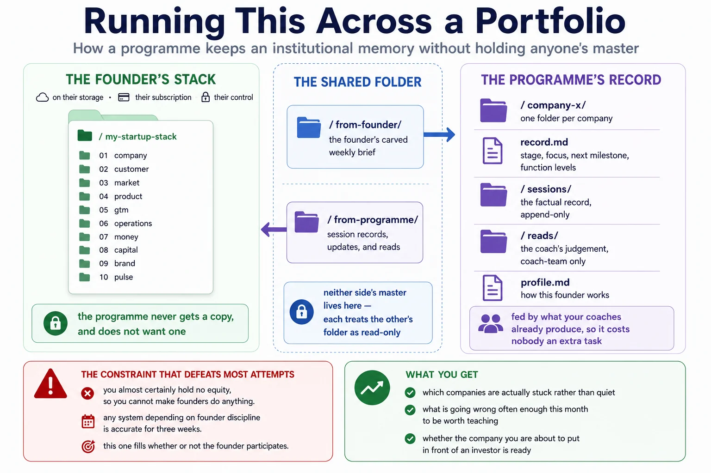

# For programmes running a portfolio

How an incubator, accelerator, studio or university venture programme runs this method across many companies at once — and keeps an institutional memory that survives a coach leaving.

This is the deeper end of [for-coaches.md](for-coaches.md). That page is about running the method *with* founders. This one is about what the programme keeps for itself.



---

## The problem you already have

Your coaching team is good. The problem is that what they know does not accumulate anywhere.

A specialist meets a founder for thirty minutes. Ten of those minutes go on establishing what the company is now, because the last conversation was with somebody else and what they learned went into a form nobody reads. Two weeks later a different specialist repeats it. The founder tells the same story four times and concludes, not unreasonably, that the programme does not know them.

Meanwhile the things you would most like to know are the things nobody can answer:

- Which companies are actually stuck, as opposed to quiet.
- What is going wrong often enough this month to be worth teaching.
- Whether the company you are about to put in front of an investor is ready.

And the structural constraint that defeats most attempts to fix it: **you almost certainly do not hold equity, so you cannot make founders do anything.** Any system that depends on founders maintaining a document will be accurate for three weeks.

## The shape of it

Three things, and which one holds what is the whole design:

**The founder owns their stack.** On their storage, under their control, built with their own AI subscription. You do not get a copy and you do not want one — see [safety.md](safety.md), and note that a founder who thinks you can read their salary discussions will not write honestly about their salary discussions.

**You own a record per company.** Not their business plan — *your* picture of their business. Assembled from what your coaches already produce, so it costs nobody an extra task.

**One shared folder per company connects them.** The founder's carved brief travels in; your session records travel out. Neither side's master lives there. That is the [exchange](exchange.md), and it is deliberately dull: a folder, two subfolders, markdown files.

```
founder's stack          shared folder            your portfolio
(theirs, private)        (both, narrow)           (yours)

  stack/        carve  →  from-founder/    read →   portfolio/<company>/
   01 … 10                                            record.md
                       ←  from-programme/  ←          sessions/
                          the session record          reads/
```

## The note is the atom

Everything the programme knows is downstream of one artifact, so it is worth being exact about it.

**Split every session into two files.** They have different owners, different readers and different lifespans:

| | The record | The read |
| --- | --- | --- |
| Holds | What was discussed, decided, committed to, and by when | How the founder is doing, how the advice landed, what worries you |
| Goes to | The founder, and your record | Your coaching team only |
| Tagged | Facts, cited and dated as normal | `[ASSESSMENT — name, date]` |
| Lifespan | Permanent, append-only | Kept only as long as it is useful |

The split is not bureaucracy. It exists because the two things fail differently. A factual record that quietly contains a judgement is unfair to the founder. A judgement recorded as though it were a fact is worse — it hardens, gets repeated by people who never met them, and follows a founder around the programme long after it stopped being true.

**Write the read as though the founder will see it.** In most places they can ask to. More usefully: a judgement you would not put in front of the person is one you have not finished thinking about. This single rule does most of the governance work, and the rest is in [safety.md](safety.md).

**Two coaches may disagree, and both entries stand.** Attributed, dated, side by side. That is not a conflict to resolve — it is two people who read the same founder differently, which is worth knowing.

## Levels, and why they route

Ask "how is this company doing" and you get an anecdote. Ask "what level is their sales function" and you get something you can compare, act on and watch move.

[`portfolio/rubric.md`](../portfolio/rubric.md) scores each company 1 to 5 on the functions the ten stack sections already name. The levels describe what is *observably true* — not how much money the company has raised, which is the thing everyone accidentally scores instead.

The rubric earns its place three times over:

- **It routes.** A company at level 1 on sales has a named specialist who should see them next. The score is the referral.
- **It shows movement.** Level 2 to level 3 over a quarter is progress you can describe to a funder without inventing a metric.
- **It aggregates.** Six companies stuck at the same level on the same function is not six coaching problems. It is next month's workshop, and it is the only cohort-level signal you will get for free.

Score the ten sections, never the folders inside them. What a company keeps inside `04-product` is its own business; that it is at level 2 on product is comparable across the portfolio.

## What this does not do

**It does not give you access to founders' stacks.** By design. You see what they carve and what your own coaches wrote.

**It does not replace judgement with a score.** The rubric tells you where to look. It does not tell you whether a founder is worth backing, and a programme that starts believing it does has built a very expensive spreadsheet.

**It does not make founders maintain anything.** The record fills whether or not the founder participates, because it is fed by your coaches. Founder participation makes it better; it is not load-bearing.

## Starting

**Do not automate first.** Run one session by hand — transcript in, two-part note out, record updated, founder sent their copy. If the coach who ran it does not think the note is better than what they write today, automating it produces the same note faster, which is not the goal. [automation.md](automation.md) is there for when the manual loop is worth repeating.

**Start with one coach and three companies.** Enough to see whether the record is genuinely useful before the whole team is asked to change how they work.

**Decide the boring things before the first note exists.** Who owns the record, how long reads are kept, what happens when a company leaves, and who answers if someone asks what is held about them. These are ten minutes of decisions now, and an unpleasant afternoon later.

**Then ask what you can offer in exchange.** You cannot compel founders, but you have something they want — specialist time, introductions, a demo-day slot, capital. [for-coaches.md](for-coaches.md) puts it plainly: make a corrected stack the price of entry to the thing they are asking for. That is not bureaucracy either; a founder who cannot describe their own unit economics is not ready for the introduction.

## Where to go next

- [exchange.md](exchange.md) — the folder that connects a founder's stack to your record
- [automation.md](automation.md) — running it on a schedule, on whichever platform you already have
- [`portfolio/`](../portfolio/) — the templates: the router, the rubric, and a company folder to copy
- [`prompts/16-session-to-record.md`](../prompts/16-session-to-record.md) — the prompt that produces the two-part note
- [safety.md](safety.md) — read the section on writing about a named person before the first note
