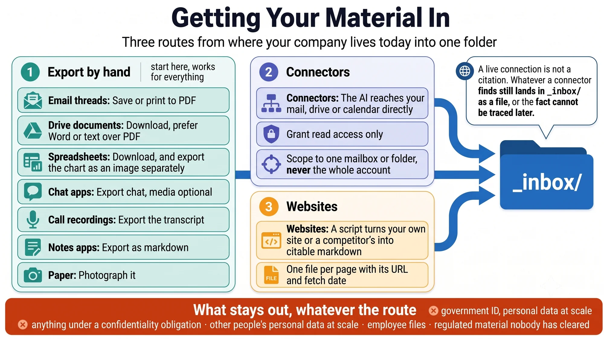

# Getting your material in

Everything the stack knows starts as a file in `_inbox/`. This page is how things get there — out of your mail, your document drive, your chat apps, your call recordings — without you retyping any of it.

There are three routes. The first works for everything and needs no setup; the other two save time once you know what you are doing.



---

## Route 1 — export by hand

The default, and the one to use for your first hour. Every system you already use has a way to get a document out of it. You do not need the perfect format — text is better than PDF, and PDF is better than nothing.

| Where it lives | How to get it out | What lands in `_inbox/` |
| --- | --- | --- |
| **Email threads** | Most mail apps can save a message or print a thread to PDF. For a long negotiation, one thread is one file. | `2026-07-24-supplier-negotiation.pdf` |
| **Documents in a drive** | Download each one. Choose Word or plain text over PDF where offered — text is cheaper for the AI to read. | `business-plan-v3.docx` |
| **Spreadsheets** | Download as a spreadsheet or CSV. **If a chart matters, also export the chart as an image** — text extraction reads the words around a graph and misses the numbers in it. | `projections.xlsx`, `growth-chart.png` |
| **Chat apps** | WhatsApp and similar have an export-chat function, usually per conversation, with or without media. Without is fine. | `whatsapp-distributor-chat.txt` |
| **Call recordings** | Export the transcript from whatever recorded it. Transcripts are the single highest-value input the stack can get — what people actually said, not what a deck claims. | `2026-07-20-customer-call.txt` |
| **Notes apps** | Most export as markdown or plain text. Markdown is this repo's native format — it drops straight in. | `product-ideas.md` |
| **Your website** | See [Route 3](#route-3--websites). | `websites/yourcompany.com/` |
| **Paper** | Photograph it. Ask the AI to read the picture. | `signed-supplier-quote.jpg` |

Two habits that pay off immediately:

- **Name files for what they are, with a date where one matters.** `2026-07-24-customer-call.txt` beats `Untitled(3).txt` every time the AI routes through the folder.
- **Do not sort, clean or summarise before you drop it in.** Sorting is the AI's job. A messy inbox with everything in it beats a tidy one missing half the company.

## Route 2 — connectors, for mail and drive

A connector lets your AI tool reach your mail, your document drive or your calendar directly, so you can say *"find the supplier thread from March"* instead of hunting for it yourself. What a connector is, and the standard underneath it, is covered in [what-things-are.md](what-things-are.md); the safety habits are in [ai-basics.md](ai-basics.md).

Setting one up is roughly the same in every tool: find the connectors or integrations section in your AI tool's settings, switch on the one you want, and authorise it against your account. Grant **read access only** to begin with, and scope it to the one mailbox or folder the task needs — not the whole account. If your company has a policy on connected tools, that conversation happens first.

**One rule keeps the stack auditable: what a connector finds still lands in `_inbox/` as a file.** A live connection is not a citation. [AGENTS.md](../AGENTS.md) requires every fact in the stack to trace to a source that can be opened later — and a search you ran once, in a chat that scrolled away, cannot be. So the working pattern is:

```
Search my mail for the thread with [supplier] from March about pricing.
Save what you find into _inbox/ as one markdown file: date, who said
what, and any figures quoted — with a note saying which mailbox it came
from and when you pulled it.
```

Where connectors genuinely beat exporting by hand: searching a large mailbox for something you half-remember, and recurring pulls — the [weekly recap](../prompts/12-weekly-recap.md) reading your calendar, or [meeting-to-actions](../prompts/14-meeting-to-actions.md) picking up a transcript as soon as the call ends.

Where they do not: your first hour. Exporting ten documents by hand is faster than setting up a connector, and the bootstrap needs files, not access.

## Route 3 — websites

Your own site and your competitors' sites are high-value input and tedious to copy by hand. [`tools/scrape-site.mjs`](../tools/) fetches a site into `_inbox/` as citable markdown — one file per page, each carrying its URL and fetch date:

```bash
node tools/scrape-site.mjs https://example.com
```

[scraping.md](scraping.md) covers the flags, what breaks, and — the part that matters — what not to scrape. Or skip the tool entirely: open the pages in a browser and save them into `_inbox/` by hand. Same result, more clicking.

## What stays out

The inbox is git-ignored, but it is still a folder an AI reads. Three things do not go in, whatever the route:

- **Anything marked restricted** — personal data, unsigned agreements, anything under a confidentiality obligation. See the sensitivity rules in [AGENTS.md](../AGENTS.md).
- **Other people's personal data** beyond what ordinary business records already contain. Researching a company is fine; harvesting its people is not.
- **Regulated material** — health, financial-account, legal-privilege — until someone has answered whether it may be processed at all. [safety.md](safety.md) is the page to read before widening access.

## Where it goes from here

Once the inbox has material in it, [the bootstrap prompt](../prompts/00-bootstrap-the-stack.md) reads everything and writes the ten sections of the stack, tagging every fact as confirmed, unverified or missing. After that, the inbox never closes: every new call transcript, quote and thread goes in, and [the refresh prompt](../prompts/01-refresh-the-stack.md) folds it into the stack without flattening your corrections.

[QUICKSTART.md](../QUICKSTART.md) walks the whole first hour in order.
