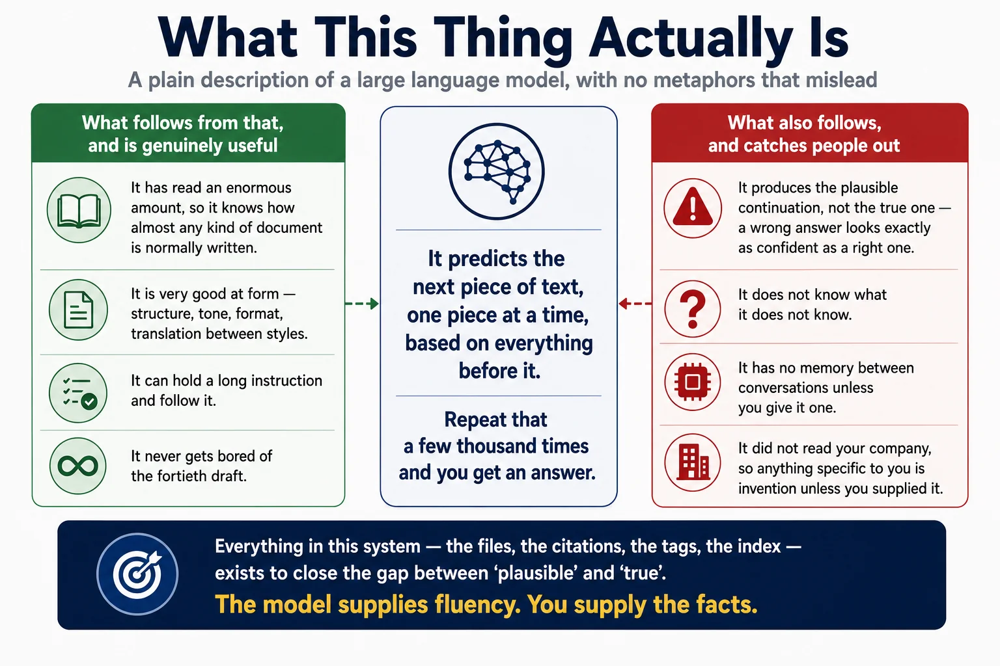
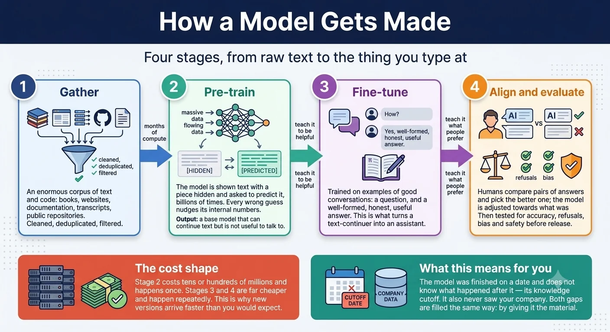
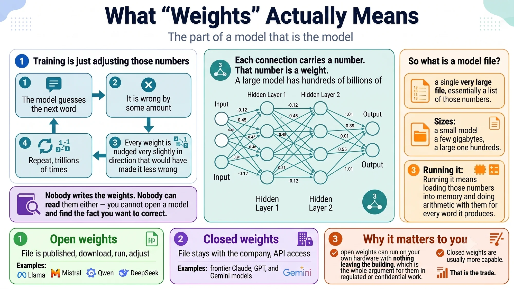
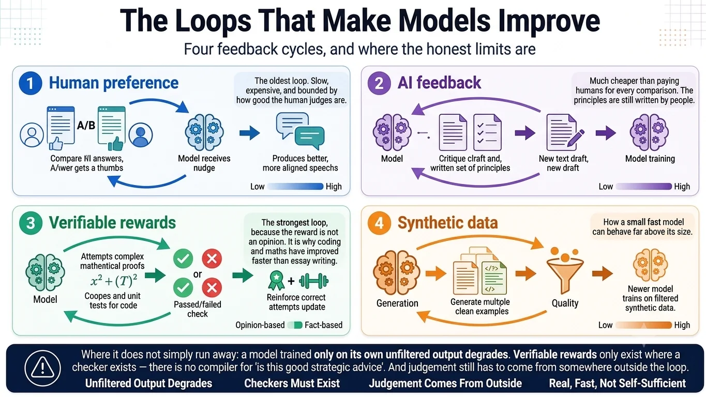
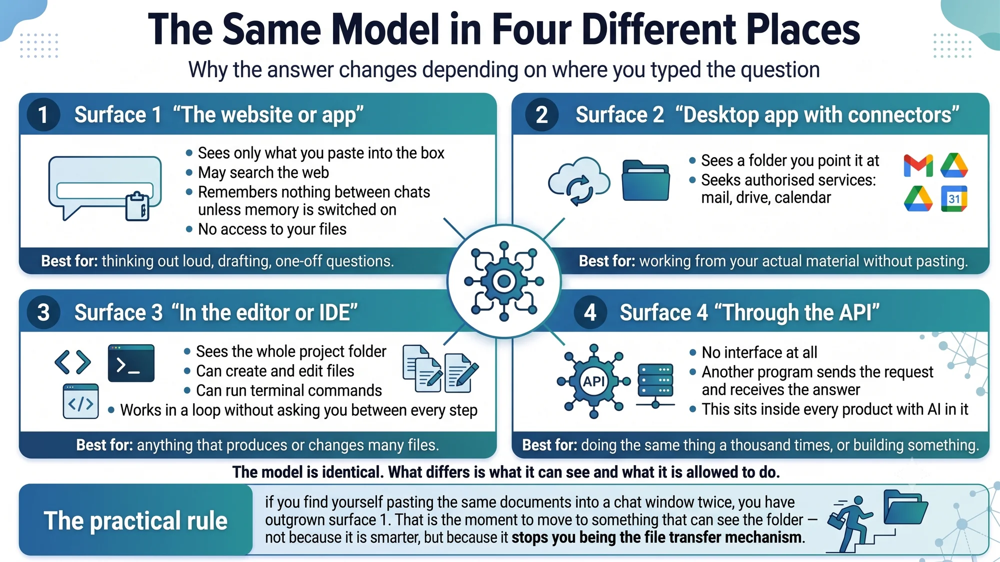
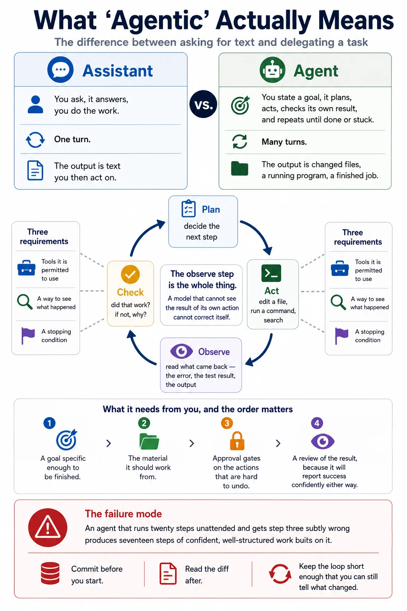
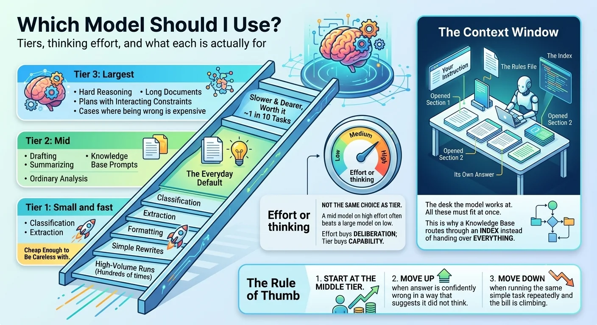
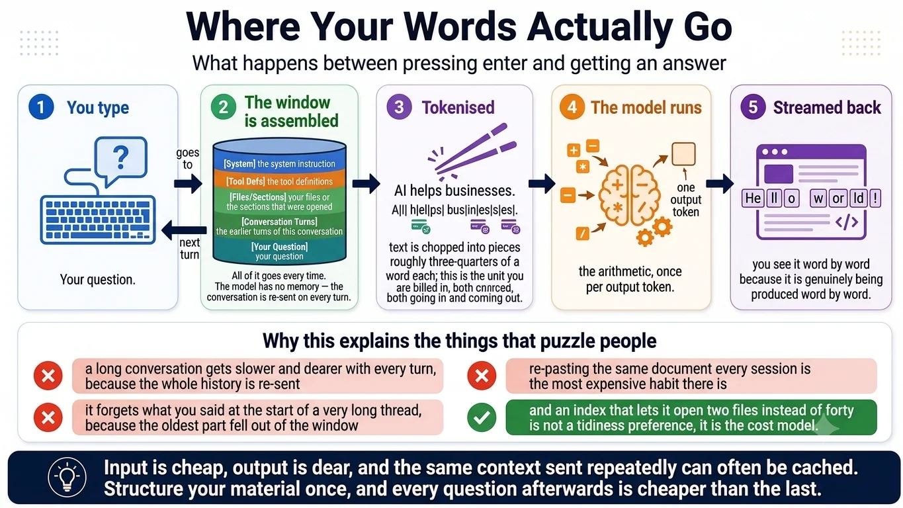

# Infographics — what AI is

Eight pictures covering the foundations: what a language model actually is, how one gets built, what people mean by weights, why the models keep improving, and what changes when the same model is put in a different place. Nothing here is specific to this repository. Take any of it for a workshop.

Click an image to open it at full size.

---

## What this thing actually is

The plain description, with no metaphor that misleads. A model predicts the next piece of text, repeatedly. Everything useful about it and everything dangerous about it follow from that one sentence.

## How a model gets made

Four stages — gather, pre-train, fine-tune, align — and the reason a new version arrives faster than the cost of the first one would suggest.

## What weights actually mean

The part of a model that *is* the model: a very large list of numbers, none of them written by a person, none of them readable afterwards. This is also where open weights and closed weights get explained, which is the choice that matters if you work under a confidentiality obligation.

## The loops that make models improve

Four feedback cycles — human preference, AI feedback, verifiable rewards, synthetic data — and an honest note on where each one stops working.

## The same model in four different places

Website, desktop app with connectors, editor, API. The model is identical in all four. What differs is what it can see and what it is allowed to do — and that difference is most of the reason two people get different results from the same question.

## What agentic actually means

The difference between asking for text and delegating a task, and the inner loop — plan, act, observe, check — that makes the second one possible.

## Which model should I use

Three tiers, a separate dial for thinking effort, and the rule of thumb that saves the most money: start in the middle and move for a reason.

## Where your words actually go

What happens between pressing enter and getting an answer, and why it explains the three things that puzzle people most: rising cost in long threads, forgetting the start of a conversation, and why an index is a cost decision rather than a tidiness preference.

---

Next: [the tools](infographics-tools.md) — terminal, Git, Node, databases and the rest of the words.
