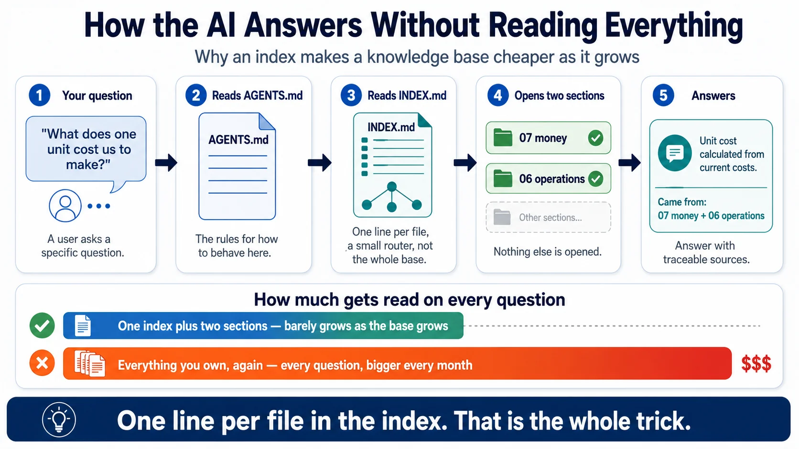
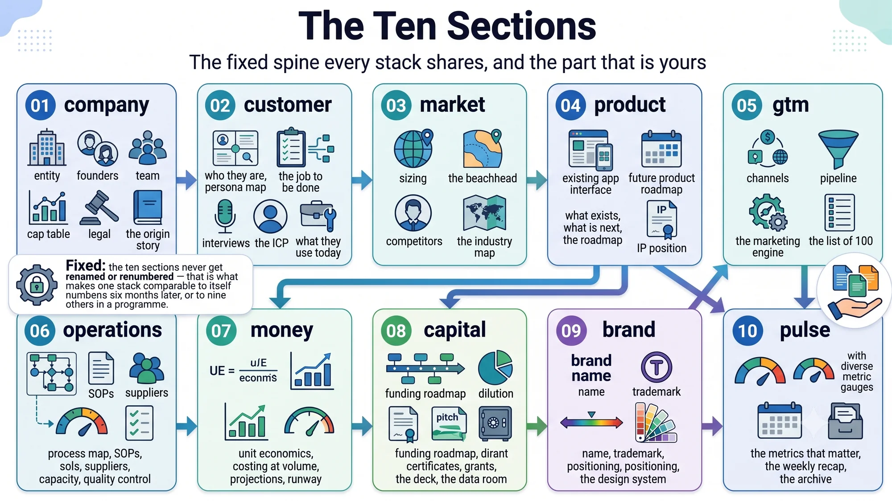
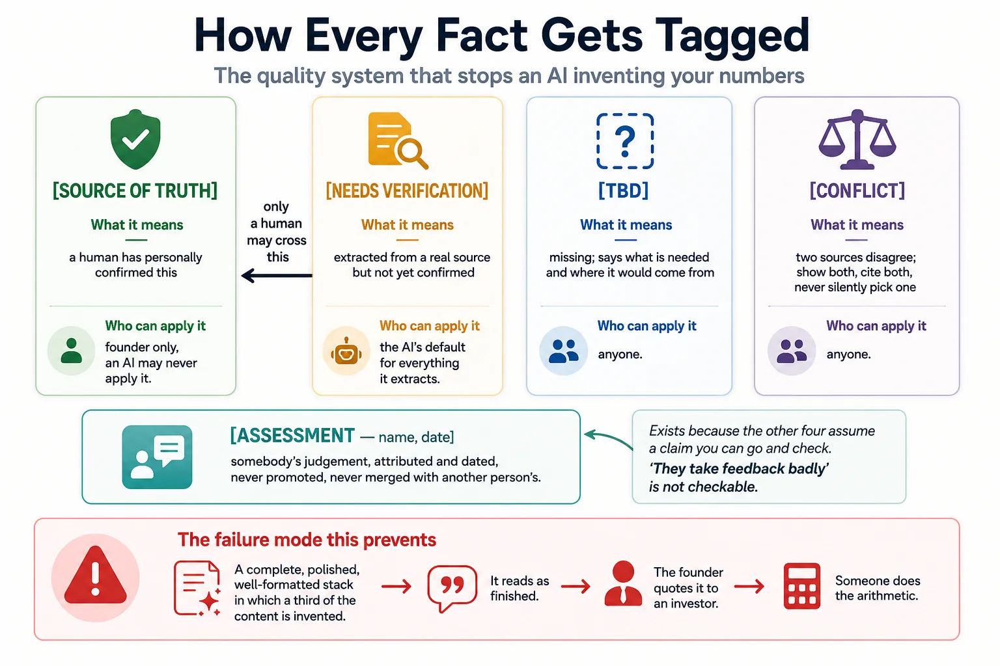
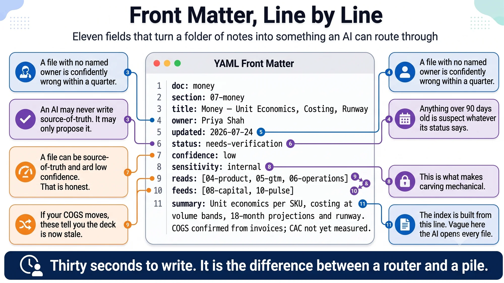
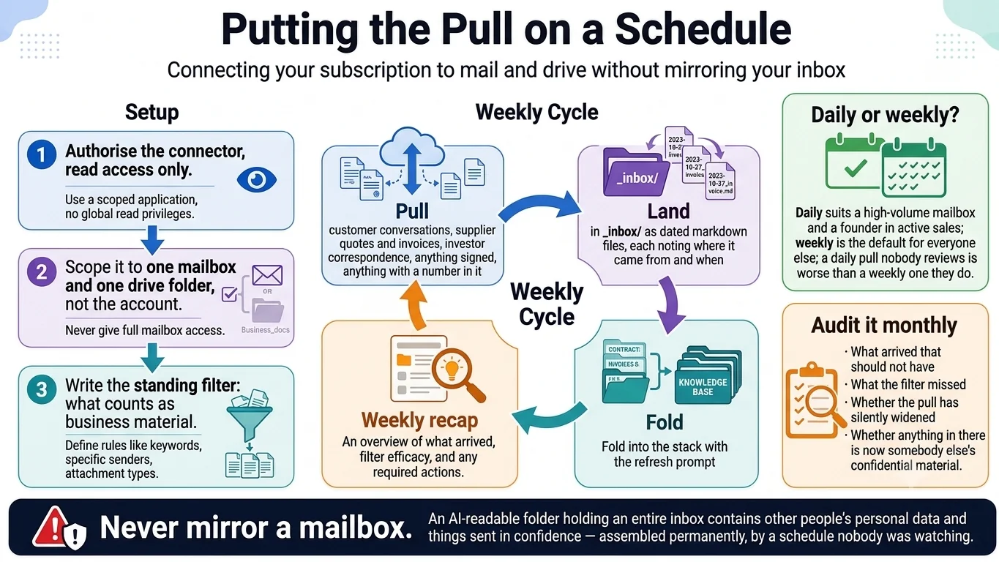
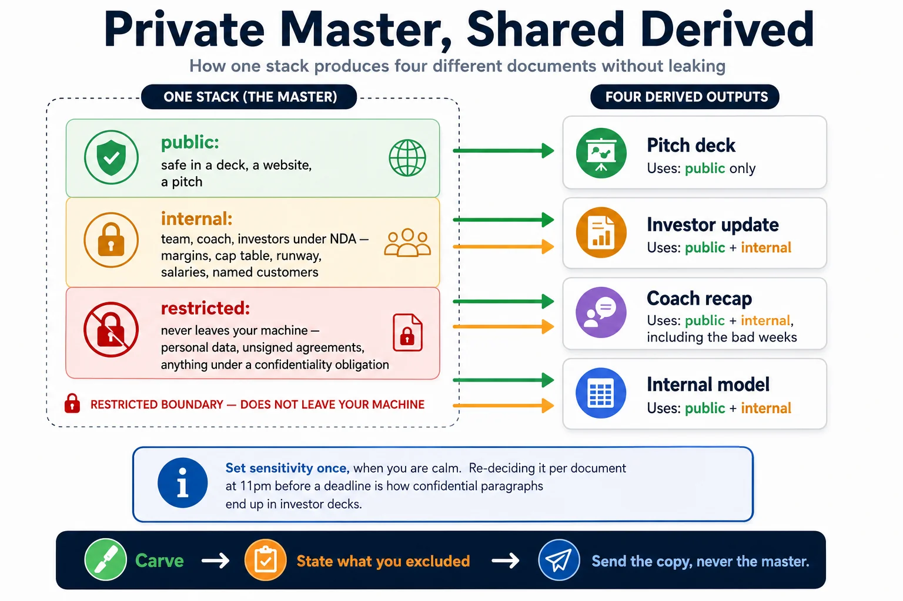
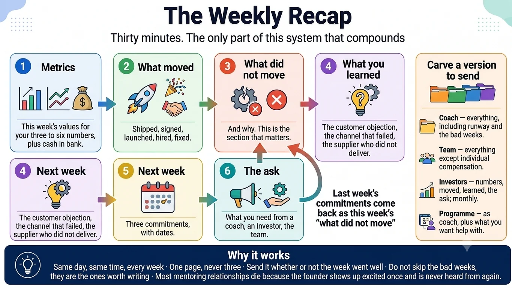

# Infographics — the method

Nine pictures of what this repository actually describes. Together they are the whole method: how scattered files become a knowledge base, how it stays honest, how material keeps arriving, and what you do with it every week.

Click an image to open it at full size.

---

## The Startup Stack method

The whole thing on one page. Raw material on the left, ten sections in the middle, the work that comes out on the right, and the three loops that keep it alive.

The written version is [the method](method.md).

## How the AI answers without reading everything

Why an index makes a knowledge base cheaper as it grows rather than dearer. This is the single idea that most people miss, and it is the reason the whole thing is structured the way it is.

## The ten sections

The fixed spine every stack shares, the dependencies between them, and the part that is genuinely yours to decide.

The written version is [build the knowledge base](knowledge-base.md).

## How every fact gets tagged

The quality system that stops an AI inventing your numbers. Four tags, who is allowed to apply each, the one-way promotion only a human may perform, and the fifth tag that exists because judgement is not a checkable claim.

## Front matter, line by line

Eleven fields annotated with the one thing that breaks when each is wrong. Thirty seconds to write; the difference between a router and a pile.

The written version is [the front matter schema](front-matter.md).

## Getting your material in

Three routes from wherever your company lives today into one folder, and the list of what stays out whichever route you take.

The written version is [getting your material in](getting-material-in.md).

## Putting the pull on a schedule

Connecting a subscription to mail and drive without mirroring your inbox — the setup, the weekly cycle, the daily-or-weekly question, and the monthly audit that most people skip.

The written version is [running it on a schedule](automation.md).

## Private master, shared derived

How one stack produces four different documents without leaking. Three sensitivity bands, four outputs, and one band that never leaves the machine at all.

The written version is [the safety rules](safety.md).

## The weekly recap

Thirty minutes, six sections, and the only part of this system that compounds. Including the arrow that brings last week's unmet commitments back as this week's uncomfortable question.

The written version is [the weekly recap](weekly-recap.md).

---

Next: [running a portfolio](infographics-portfolio.md) — the layer for a programme rather than a single founder.
