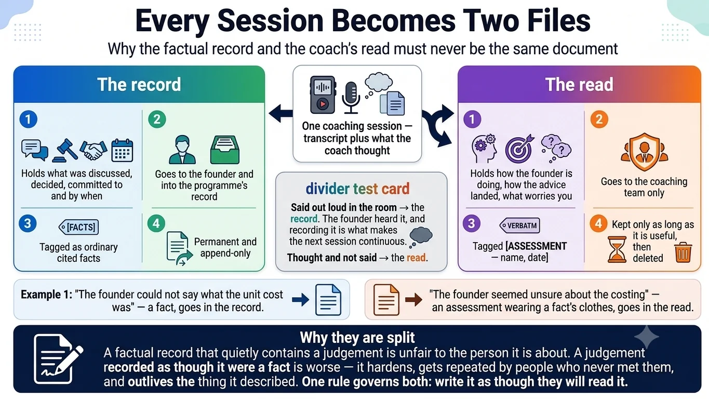
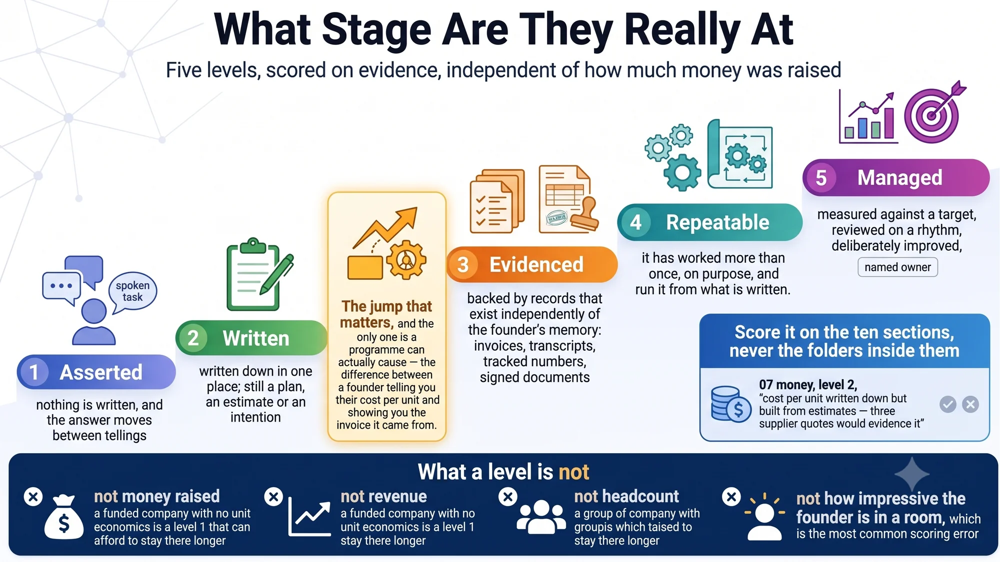

# Infographics — running a portfolio

Three pictures of the layer that sits above a single founder: what an incubator, accelerator, studio or university programme keeps for itself, and how it does that without holding anybody's master copy.

Click an image to open it at full size. The written version is [for programmes](for-portfolios.md).

---

## Running this across a portfolio

The three-zone architecture. The founder's stack on the left under their control, the programme's record on the right built from what coaches already produce, and a deliberately thin shared folder between them.

Including the constraint that defeats most attempts at this: you almost certainly hold no equity, so any system that depends on founder discipline is accurate for about three weeks.

## Every session becomes two files

Why the factual record and the coach's read must never be the same document, and the test that decides which one a sentence belongs in: said out loud in the room, or thought and not said.

The written version is [the exchange folder](exchange.md).

## What stage are they really at

Five maturity levels scored on evidence rather than on funding, revenue or headcount — and the one step a programme can actually cause.

The written version is [the maturity rubric](../portfolio/rubric.md).

---

Back to [all the infographics](infographics.md).
