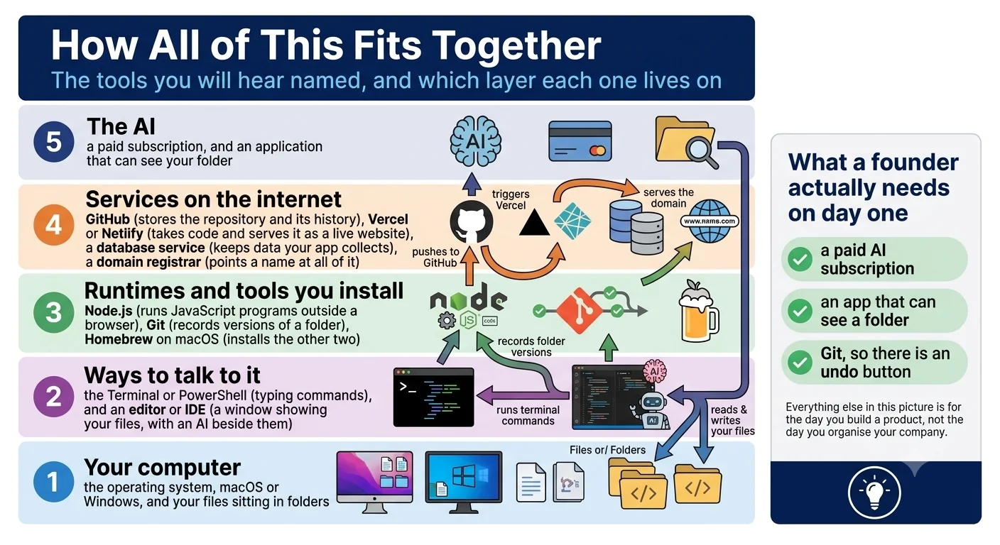
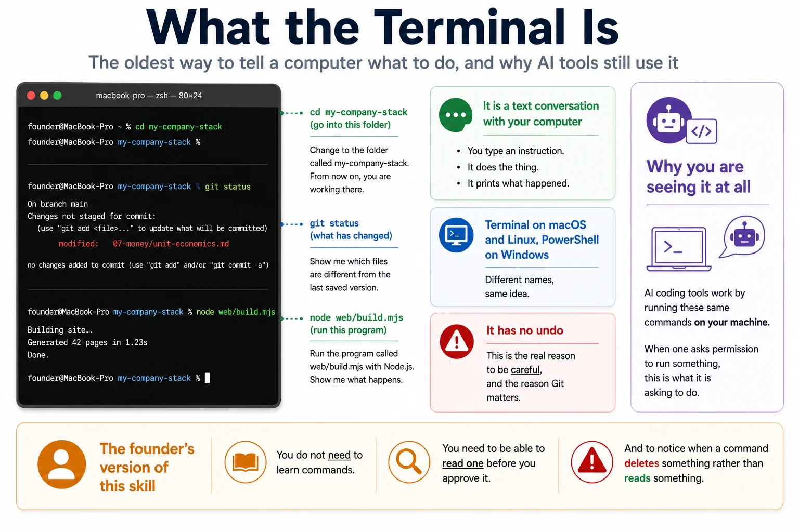
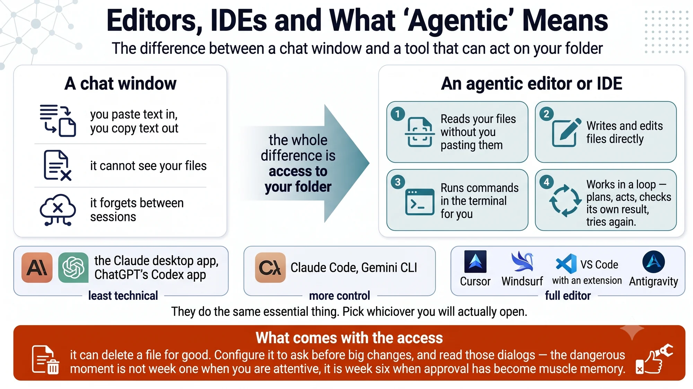
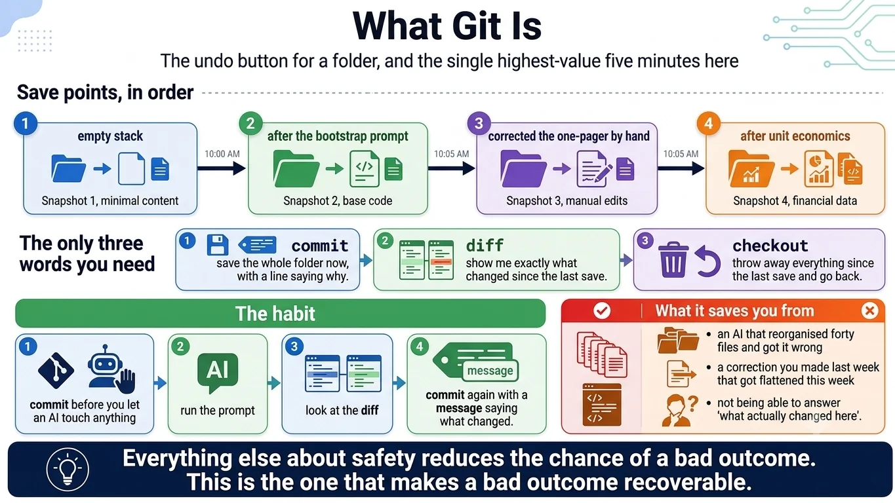
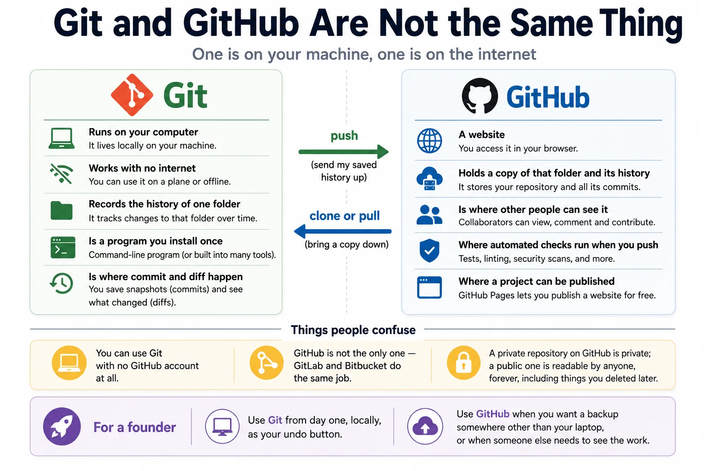
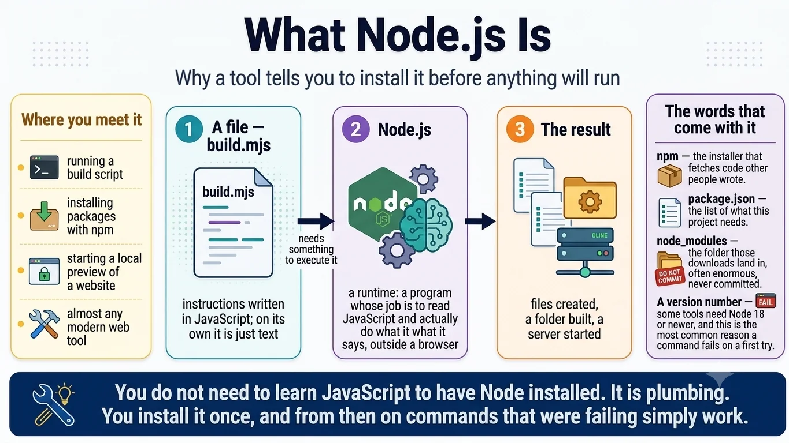
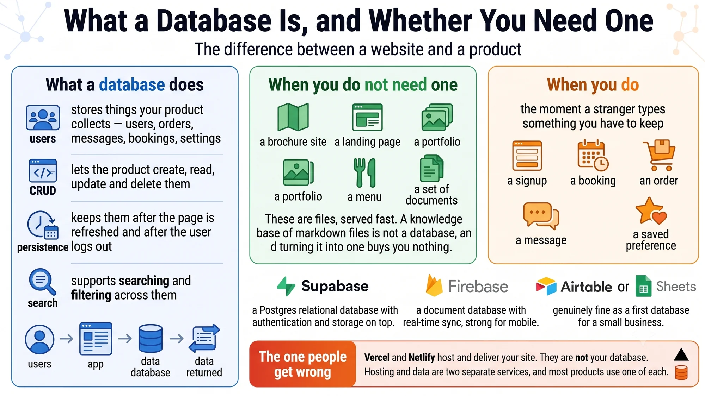
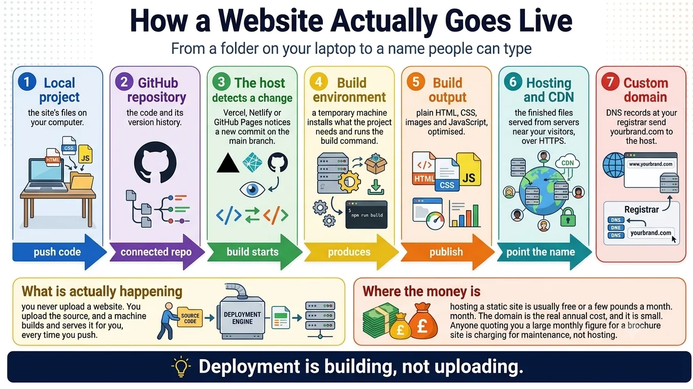
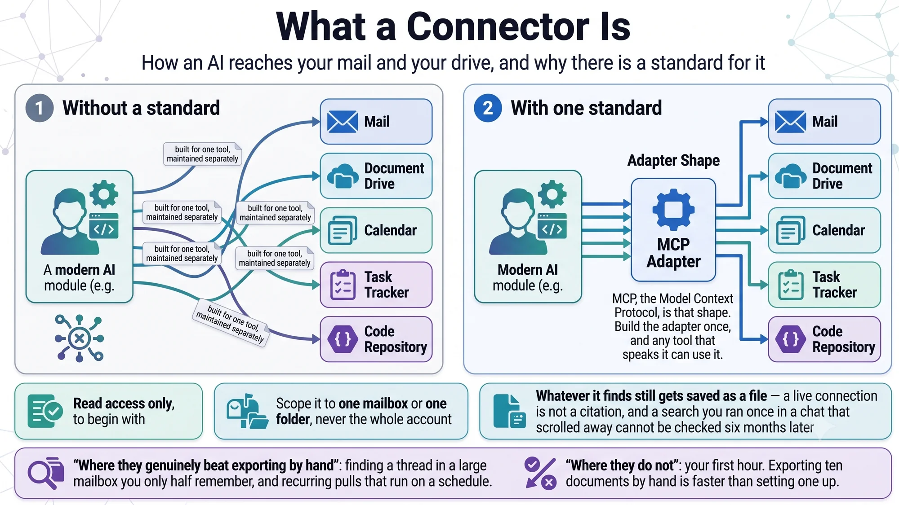
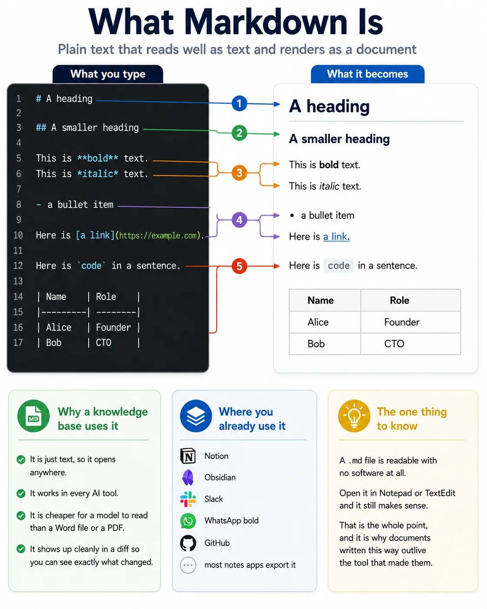

# Infographics — the tools

Ten pictures explaining the words you will hear and be expected to nod along to. Most of them are not things a founder building a knowledge base has to learn — they are things a founder has to stop being intimidated by.

If you only look at one, look at the first. It shows which layer each of the others lives on, which is the part nobody explains.

Click an image to open it at full size. The written version of most of this is [what things are](what-things-are.md).

---

## How all of this fits together

Five layers, from your own computer up to the AI, and which tool sits on which. Also the honest note about how few of them you actually need on day one.

## What the terminal is

The oldest way to tell a computer what to do, why AI tools still use it, and the only skill a founder actually needs here: being able to read a command before approving it.

## Editors, IDEs, and what agentic means

The difference between a chat window you paste into and a tool that can see your folder, edit it, and run commands. Also what comes with that access.

## What Git is

The undo button for a folder. The highest-value five minutes on this entire site, and the only safety measure that makes a bad outcome recoverable rather than merely less likely.

## Git and GitHub are not the same thing

One runs on your machine with no internet. The other is a website. People conflate them constantly, and it makes every explanation of both harder to follow.

## What Node is

Why a tool tells you to install something before anything will run, and what npm, `package.json` and `node_modules` are. Plumbing, explained once so it stops being mysterious.

## What a database is, and whether you need one

The line between a website and a product. Most things a founder builds first do not need a database, and knowing which side of the line you are on saves a great deal of money.

## How a website actually goes live

Seven stages from a folder on your laptop to a name people can type. Useful mostly because it shows that you never upload a website — you upload the source, and a machine builds it.

## What a connector is

How an AI reaches your mail and your drive, why there is now a standard for it, and the three habits that keep it from becoming a liability.

## What markdown is

The format this entire method is built on. Plain text that reads well as text and renders as a document, and outlives whatever tool made it.

---

Next: [the method](infographics-method.md) — this repository, drawn.
