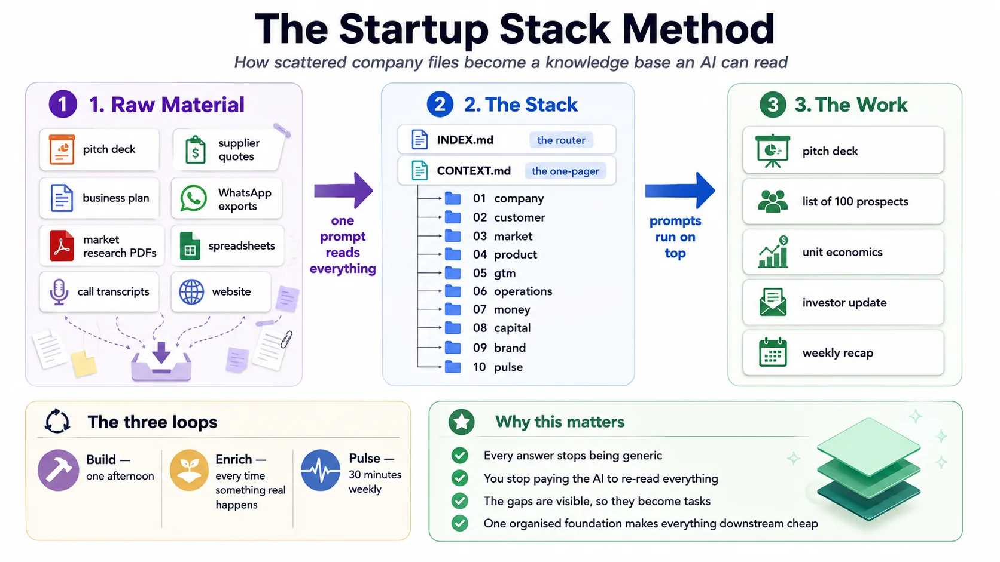

# The method

`startup-stack` packages a way of working, not just a folder of templates. This page explains the six ideas it is built on, in enough detail that you could re-derive the whole thing from scratch.

The method was not designed in the abstract. It comes from two places that turned out to be the same place: a working incubator knowledge base that produces an organisation's decks, reports and monthly metrics from one structured folder, and a lot of 1:1 founder mentoring in which the same twenty questions kept getting asked because founders could not answer them from their own files.



---

## 1. A knowledge base is not software

The intimidating part is a myth. There is nothing to install, nothing to code, no database and no developer. A knowledge base is a well-labelled set of folders and plain-text files that describe your company, arranged so that an AI given access to that folder starts every task already knowing your data, your people, your numbers and how you like things done.

Most founders never start because they picture a system that has to be perfect before it is useful. The truth is the opposite: you start from the folders you already have, imperfect as they are, and improve them a little at a time.

What makes it work is not the technology. It is that **the act of writing it down forces the questions**. You cannot fill in `07-money/money.md` without knowing what a unit costs you. You cannot fill in `02-customer/customer.md` without being specific about who the customer is. Founders routinely discover, three hours into building their stack, that they do not know something they had been assuming for a year.

## 2. Front matter and an index are what make it cheap

This is the technical heart of the system, and it is a small block of YAML at the top of every file.

Every file opens with a small block of tags — what the file is, who owns it, when it was updated, whether it is confirmed, and a one-sentence summary. `stack/INDEX.md` collects every one of those summary lines into a single table.

```
Ask a question
      │
      ▼
 Read INDEX.md          ~1,500 tokens — one line per file
      │
      ├─ decide which 1–2 sections are relevant
      ▼
 Open those sections    ~3,000 tokens
      │
      ▼
 Answer

versus, without an index:

 Read everything        ~60,000 tokens, every single time
```

An AI is billed by how much text it reads and writes, and it gets measurably worse as its context fills with irrelevant material. The index is the difference between a base that gets *cheaper and sharper* as it grows and one that gets more expensive and vaguer. At ten files the difference is annoying. At sixty files — which is where a real company lands after a year — it is the difference between a tool you use daily and one you abandoned.

The `reads:` and `feeds:` edges in front matter do the same job one level down. `08-capital` declares that it reads `07-money`; so when you ask for a fundraising narrative, the AI knows to open unit economics without being told, and knows not to open the supplier list.

## 3. Tag honestly — the gaps are the product

Every fact in the stack carries a status: `source-of-truth`, `needs-verification`, `tbd`, or `conflict`.

This looks like bureaucracy. It is the entire quality system, for two reasons.

**It makes the AI safe to use.** A model asked to summarise your business will produce a fluent, complete, confident document. Perhaps a third of it will be inference presented as fact — a market size it reasoned toward, a margin that sounded right, a competitor it half-remembers. Without tags, you cannot tell which third. With tags, the model's own uncertainty is on the page, and the rule that *only a human promotes a fact to source-of-truth* means nothing gets confirmed by accident.

**It converts anxiety into a task list.** A founder who does not know their CAC feels vaguely behind. A founder whose stack says `CAC: [TBD — needs 30 days of tracked spend against tracked signups]` has a job to do on Tuesday. Gaps you can see are work. Gaps you cannot see are dread.

The corollary is uncomfortable and worth stating plainly: **a polished stack is a suspicious stack.** If a first bootstrap comes back with every field filled and no `[TBD]` markers, the model has invented things. Send it back.

## 4. The founder validates; the AI never gets the last word

This is the hardest-won rule in the method, and it is the one people skip. AI-drafted operating procedures, put in front of the people who actually do the work, come back with real corrections — a wrong owner, a step that only exists in someone's head, a number that changed last year and never made it into the file. Validation is not a formality. **Any AI-drafted document should be treated as wrong until the person who owns the reality has corrected it.**

For a startup stack that means:

- The AI extracts and structures. It is very good at this and it will save you a week.
- The AI proposes. It can say "this reads like a working-capital problem, not a marketing problem."
- The AI never confirms. It cannot know whether the supplier actually agreed to those terms, whether the customer meant what the transcript says, or whether the number in the deck was ever true.

The practical rhythm: bootstrap in an afternoon, then correct one section per sitting over a couple of weeks. Correcting is slower than generating and that asymmetry is the whole cost of the system. Budget for it or the stack is fiction.

## 5. Private master, shared derived

You keep one master stack containing everything, including the parts that would be actively harmful to circulate: margins, runway, cap table, salaries, named customers, unsigned agreements, the deal you nearly did and did not.

Everything that leaves — the pitch deck, the investor update, the coach's copy, the vendor one-pager, the trade sheet — is **carved** from the master, never sent as the master. The `sensitivity:` field on each file is what makes carving mechanical rather than a judgment call you make while tired at 11pm.

```
stack/  (master — everything)
  │
  ├─ public   ──▶ website copy, pitch deck, flyer, one-pager
  ├─ internal ──▶ coach copy, investor update, board pack, team wiki
  └─ restricted ─ never leaves this machine
```

Founders lose deals and occasionally get sued because a file that was fine internally went out with one paragraph nobody re-read. Declaring sensitivity once, at the file level, when you are calm, is much safer than deciding it repeatedly, per document, under time pressure.

## 6. The pulse is the only part that compounds

A knowledge base that is built once and never updated decays into a static report within a quarter. Every organisation that has tried this discovers the same thing: without a named owner and a fixed rhythm, the base stops being true, and a base that is not true is worse than none because people still quote it.

The rhythm here is the **weekly recap**: thirty minutes, one file, fixed shape, every week, forever. It has six sections — the numbers (including how many weeks of money are left), what moved, what did not, what you learned, what you are committing to next, and where you need help — and it is the file you send to your coach, your co-founder and your investors.

Three properties make it work:

**Fixed shape.** Same headings every week. Comparability is the whole point — you should be able to read six recaps in a row and see a trend without doing any work.

**It reads from the stack and writes back into it.** The recap prompt pulls current numbers out of `10-pulse/pulse.md` and pushes what changed back in. Doing the recap *is* the maintenance. There is no separate "update the knowledge base" chore, which is good, because that chore never gets done.

**It is honest about the bad weeks.** A recap where three of five metrics went sideways is more useful than one that finds something positive to say. The pattern that kills companies is not a bad month; it is four bad months that each got narrated as "building momentum."

---

## What the method deliberately does not do

**It does not tell you whether your idea is good.** It makes your idea legible enough that you — or a coach, or an investor — can tell. Those are different things and conflating them is how founders end up with a beautifully documented business nobody wants.

**It does not replace talking to customers.** The stack has a section for interview notes because interviews are the input. No amount of structuring substitutes for the founder personally going to a hundred shops, or fifty societies, or ten hospitals. The most common thing a good coach says is not "refine your positioning" — it is *"your list has five names on it, go make it a hundred."*

**It does not automate the work.** The AI builds structure; people run it. Trackers still get updated by hand. Customers still get called. The stack makes the compiling and the reporting cheap; it does not make the business happen.

**It is not a substitute for a lawyer, an accountant, or a doctor.** Several sections touch regulated ground — entity structure, equity, compliance, health claims. They exist to make sure you *ask* the right professional the right question, with your facts already organised. They are not the answer.

---

## About the examples

The worked examples throughout this repo are constructed. Where one resembles a real business, the resemblance is to a category, not to a company: sectors are generic, cities are unnamed, and no figure in any example is a real company's number. Nothing here is drawn from an identifiable engagement.

---

## Reading order

- [knowledge-base.md](knowledge-base.md) — how to actually build it: taxonomy, extraction, the index, the token economics
- [front-matter.md](front-matter.md) — the schema, field by field
- [weekly-recap.md](weekly-recap.md) — the pulse ritual in detail
- [for-coaches.md](for-coaches.md) — running this with a cohort
- [safety.md](safety.md) — guardrails for giving an AI access to your files
